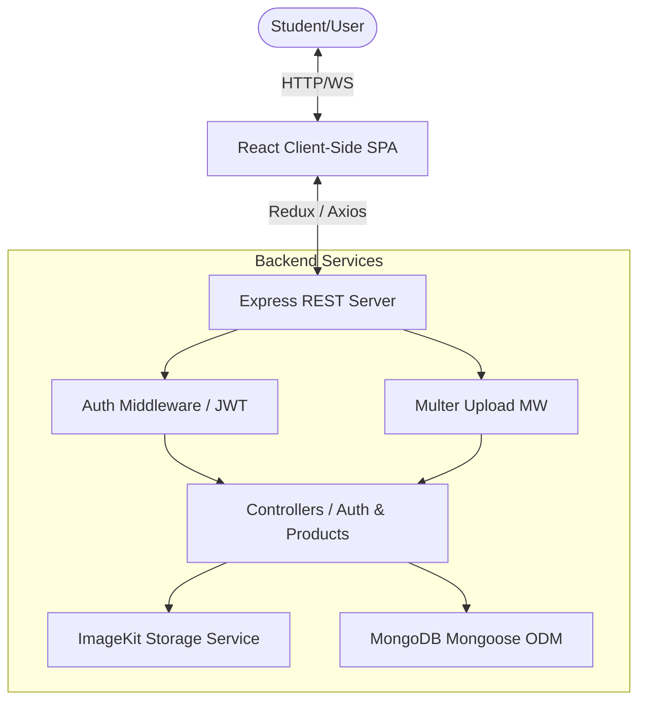
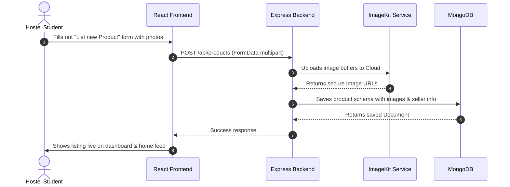

# 🏫 HostelMart.in — Centralized Student Peer-to-Peer Marketplace

> **Empowering hostel students to buy and sell second-hand hostel essentials seamlessly, securely, and directly within their campus community.**

---

## 🎯 The Core Problem & Our Vision

In college hostels, students buy and sell second-hand items (coolers, mattresses, bicycles, tables, textbooks, electronics) continuously. Traditionally, this is done via WhatsApp/Telegram groups, leading to:
* **Spam & Flooding:** Selling messages drown out critical academic and administrative notices.
* **Information Decay:** Important listings get buried quickly; buyers must scroll through thousands of messages.
* **No Search or Filters:** Zero ability to compare prices or browse by category (e.g., "coolers").
* **Zombie Listings:** Sold items remain visible, causing endless confusion and dead leads.

**HostelMart.in** solves this by introducing a centralized, beautifully designed peer-to-peer marketplace. By creating an organized, searchable community listing page, it simplifies campus commerce, saving students time, money, and clutter.

---

## 🛠️ Tech Stack & Technologies Used

HostelMart.in is built as a single-unit full-stack JavaScript application:

| Layer | Technology | Purpose |
| :--- | :--- | :--- |
| **Frontend** | **React 19 & Vite 8** | High-performance client-side rendering & rapid builds. |
| **State** | **Redux Toolkit** | Centralized global state management (auth state, watchlist state). |
| **Styling** | **Vanilla CSS & TailwindCSS** | High-fidelity fluid transitions, responsive layouts, glassmorphism. |
| **Backend** | **Node.js & Express v5** | Lightweight, robust asynchronous API endpoints. |
| **Database** | **MongoDB & Mongoose** | Flexible document storage for profiles, listings, and watchlists. |
| **Storage** | **ImageKit Integration** | Real-time cloud storage, scaling, and processing of product photos. |
| **Auth** | **JWT & Passport Google OAuth** | Secure, cookie-based sessions and effortless campus email login. |

---

## 📐 Architecture & System Flow

Every student on HostelMart.in acts as **both a buyer and a seller** natively. There are no separate role boundaries. The platform is architected as an authenticated SPA backed by a secure RESTful API.

### 🔄 System Architecture Flow



### 📈 Product Listing & Browsing Flow



---

## ✨ Key Features

* **Unified P2P Account:** Instantly list products for sale or browse others' products using the same account. No role switches required.
* **Smart Categorization & Search:** Real-time query filtering (coolers, cycles, study tables, mattresses) to find items in seconds.
* **Interactive Image Uploads:** Live photo drag-and-drop slots featuring real-time aspect-ratio preview cropping and absolute caps.
* **Direct WhatsApp Integration:** Direct one-click contact buttons that open pre-populated bargaining messages directly to the seller's WhatsApp.
* **Real-Time Watchlist:** Save interesting deals to a personalized glassmorphic watchlist with zero-flicker add/remove buttons.
* **Seller Control Center:** An intuitive personal Dashboard to track active listings, edit titles/prices, or mark items as "Sold" to clear them from search results.

---

## ⚡ Engineering Challenges & Solutions

### 1. The Multipart Form-Data Update Bug
* **Challenge:** Traditional text updates work with standard JSON endpoints. However, when students wanted to edit their listings to add new photos, the route parser crashed because standard Express validation could not parse mixed multipart `FormData` without `multer` attached.
* **Solution:** Attached `upload.array('images', 7)` middleware directly to the `PUT /api/products/:id` endpoint and updated the controller to handle new image uploads, securely appending them to the document before executing Mongoose `.save()`.

### 2. Watchlist Deserialization Crashes
* **Challenge:** The frontend Watchlist page expects fully populated product objects to render properly. Initially, adding/removing products in the database only returned the updated raw array of ObjectID strings, which caused immediate rendering crashes in React.
* **Solution:** Configured the `addToWatchlist` and `removeFromWatchlist` controller hooks to chain `.populate('watchlist')` before responding to the client, guaranteeing safe frontend state synchronization.

### 3. SPA Catch-All Monolith Routing
* **Challenge:** Serving client-side single-page routers (React Router) on a unified node deployment can throw 404 errors when visitors refresh a page (like `/profile` or `/watchlist`).
* **Solution:** Configured an ES-Module safe static asset pipeline utilizing `express.static` pointing to `dist` and implemented a wildcard catch-all route `*name` that forwards non-API requests straight to React's `index.html`.

---

## 🚀 Local Development Setup

To run the application locally on your machine, follow these steps:

### 1. Prerequisites
Ensure you have **Node.js** and **MongoDB** installed on your local machine.

### 2. Backend Environment Variables
Create a `.env` file in the `/Backend` directory and populate it with the following configuration:
```env
MONGO_URI=your_mongodb_connection_string
JWT_SECRET=your_jwt_signing_secret
GOOGLE_CLIENT_ID=your_google_oauth_client_id
GOOGLE_CLIENT_SECRET=your_google_oauth_client_secret
IMAGEKIT_PRIVATE_KEY=your_imagekit_private_key
RAZORPAY_KEY_ID=optional_razorpay_key
RAZORPAY_KEY_SECRET=optional_razorpay_secret
```

### 3. Start the Backend Server
```bash
cd Backend
npm install
npm run dev
```

### 4. Start the Frontend Dev Server
```bash
cd Frontend
npm install
npm run dev
```

---

## 🤝 Contribution Guidelines

We welcome contributions from hostel students, developers, and UI/UX designers! To contribute:

1. **Fork the Repository** to your GitHub account.
2. **Create a Feature Branch** detailing your additions:
   ```bash
   git checkout -b feature/awesome-new-feature
   ```
3. **Commit your changes** clearly:
   ```bash
   git commit -m "feat: add premium dark mode palette to dashboard"
   ```
4. **Push to the Branch**:
   ```bash
   git push origin feature/awesome-new-feature
   ```
5. **Open a Pull Request (PR)** detailing the changes, visual screenshots, and context. We'll review it immediately!

---


*Designed with ❤️ for students, by students.*
